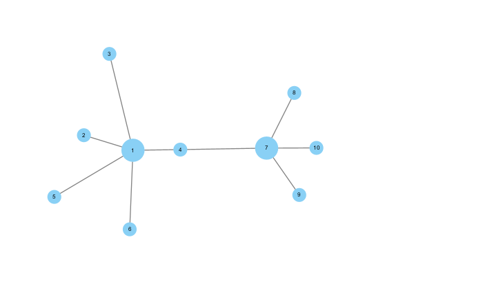
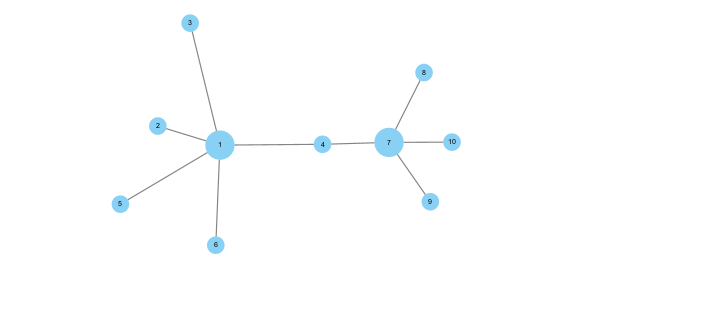
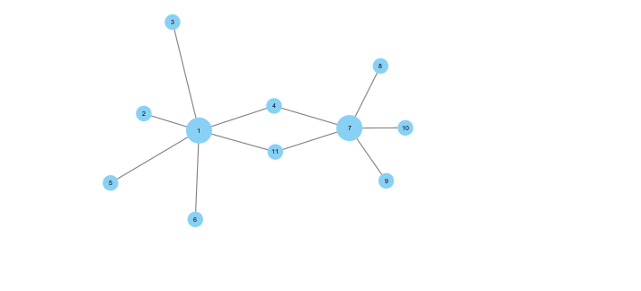
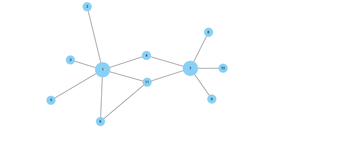
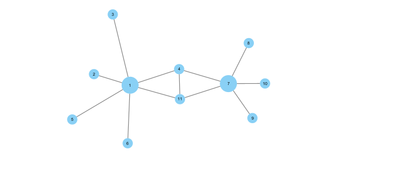
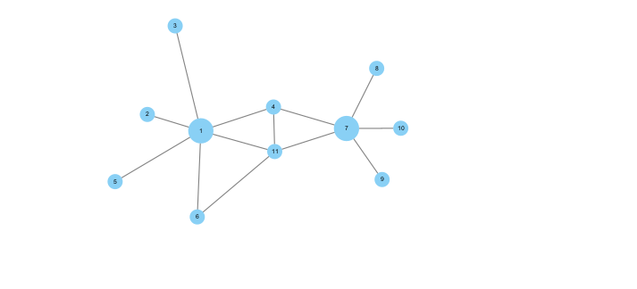

# 示例数据说明

## Example 1

两个中心城市（1与7）与其周边城市构成的城市网络。城市 4 位于两个中心城市的中间。

- [vlist1.csv](./vlist1.csv)
- [elist1.csv](./elist1.csv)

## Example 2

同 Example 1，区别在于城市 4 更加靠近城市 7。对比 Example 1 和 Example 2 可以分析距离对于集聚阴影的影响。

- [vlist2.csv](./vlist2.csv)
- [elist2.csv](./elist2.csv)

## Example 3

同 Example 1，区别在与城市 4 位于二者的正中间，并且加入竞争城市 11。

- [vlist3.csv](./vlist3.csv)
- [elist3.csv](./elist3.csv)

## Example 4

- [vlist4.csv](./vlist4.csv)
- [elist4.csv](./elist4.csv)

在 Example3 的基础上，为城市 11 引入了竞争优势。

## Example 5

- [vlist5.csv](./vlist5.csv)
- [elist5.csv](./elist5.csv)

在 Example3 的基础上，为城市 4 与 11 引入联系。

## Example 6

- [vlist6.csv](./vlist6.csv)
- [elist6.csv](./elist6.csv)

Example 4 与 Example 5 的组合。
